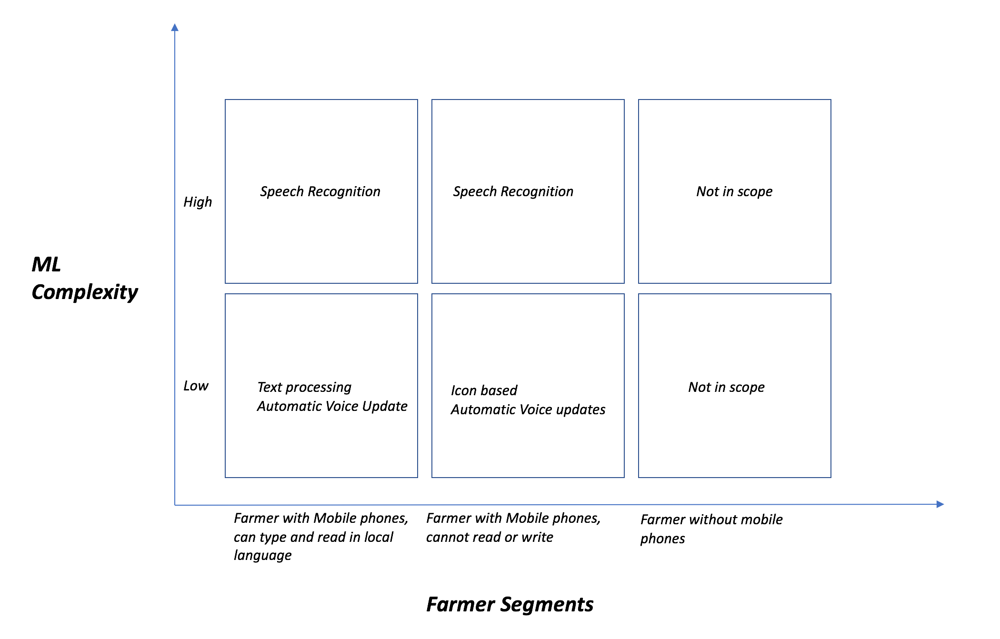

# AgriBots: Machine learning based ChatBots for Indian farmers   

#### Keywords: Agriculture, Machine Learning, Chatbot

## Problem Overview
Farmers in Indian markets have low exposure to best practices on improving farming yield and crop lifecycle management. Indian Government is helping farmers using call centers to answer questions & alerts on advisories. Close to 140 million farmers in India currently don't have access to  the schemes run by the Government[@noauthor_agricultural_nodate]. To complicate the problem further, Indian farmers speak 122 different languages, grow different crops across various land profiles. Even though Indian farmers are gaining access to cheaper smartphones and internet data, the Government isn't even able to cover less than 1% of the farmer population with their current initiatives. Need for large human resources, language competencies and farming expertise are limiting the scale of program success to a larger percentage of farmers. 

## Proposed Solution
To solve this problem, we plan to develop intelligent chatbots which can take SMS or voice questions from farmers in natural language and reply with real-time information reliably without manual intervention. The farmer segments and possibile solutions are broken down into following segments: 

In cases where the bot cannot understand the query, a human being will intervene and provide a feedback loop to the chatbot. This real-time feedback loop will be crowdsourced to improve the capabilities of the chatbot making it an evolving system improving farmer welfare. The basic components needed to build this system are:

#### a) SMS's translation engine:
The purpose of this component is to translate the questions posted by farmers into English and translate the answers from English to the local language. 

#### b) Speech Recognition:
Use to support farmers who are illiterate and can only speak in local language. This component takes voice input, translate it to English or local language and using automatic voice updates, provides feedback to the farmers. 

#### c) Farmer Database: 
Every farmer will use their phone number to register to the application. As they provide ask questions, we will use the information to build the farmer profile (phone numbers, location, crops). The information of individual farmers will be private and only aggregate information at city/county level will be shared to monitor trends. 

#### d) Q&A Engine: 
This will be used to identify if a question asked by farmer can be intelligently answered without ambiguity based on text mining the training data available. Also used to store information on most asked query types and available API's to retrieve information on the query types. Example: Weather data which can be retrieved on a real-time basis from publicly available API's.  

#### e) Feedback Engine - New Questions: 
When a question cannot be answered without ambiguity, the chatbot stages this question for manual intervention for feedback to improve the training data and effectiveness of Q&A engine. 

#### f) Learning by Leveraging the Crowd:
The effectiveness of Agribot as well as feedback on new questions can be improved by crowdsourcing the issues and taking feedback from NGO's, Government entities, agri experts and farmer cooperatives & societies. The flow to capture this should be automated as well based on incidence of an issue type and significance to existing user base. 

#### g) Agribot Effectiveness: 
In addition to unsupervised learning on the datasets, the Agribot should also request feedback from farmers to improve & validate precision and accuracy. Need to develop feature sets to include this workflow into the feedback engine. 
[@lowe_decision_2004]

## Outcomes
The outcome of this solution is to improve scaling the Government initiatives to 10 million farmers by end of 2019 and 25 million farmers by end of 2020. This system would not only help farmers develop best practices across crop selection, crop yield management but also allow them to get the best price for their produce. In addition to improving productivity, this would help Government monitor early warning signs of diseases and areas which need most help by utilizing aggregate information from the Agribot.  We plan to expand the chatbot to process image inputs by farmers to help provide personalized recommendations on crop growth, diseases and review produce quality using image processing techniques by end of 2020.
[@parker_is_2016]
[@mendelson_strategic_2007]

